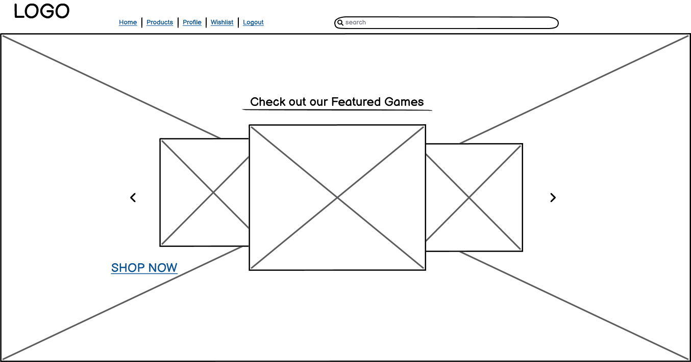
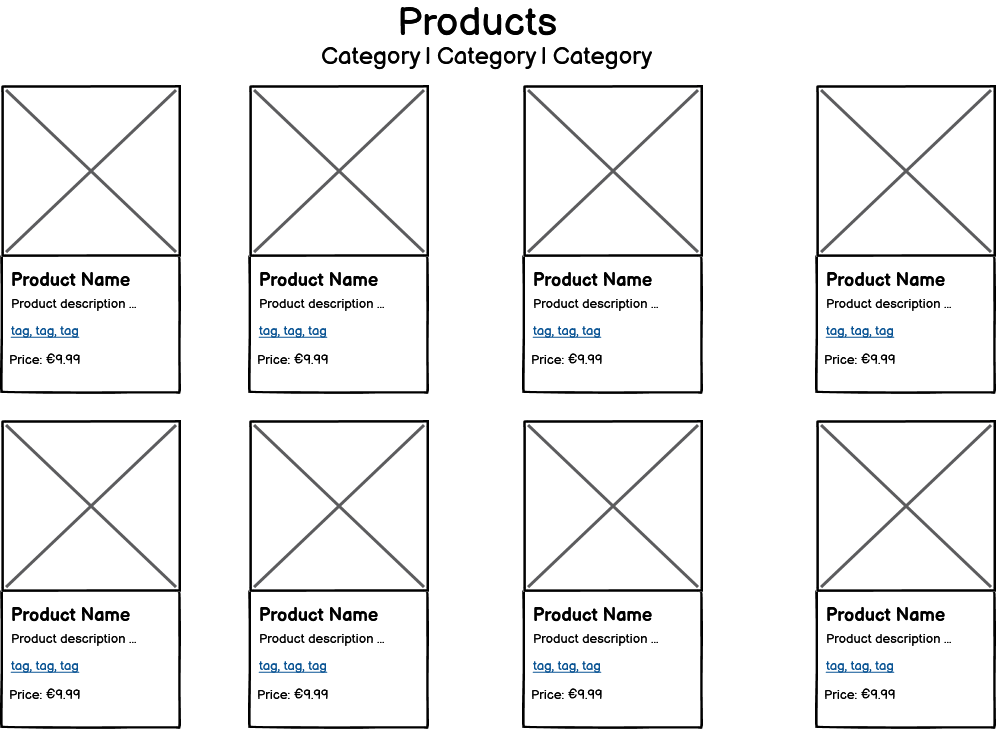
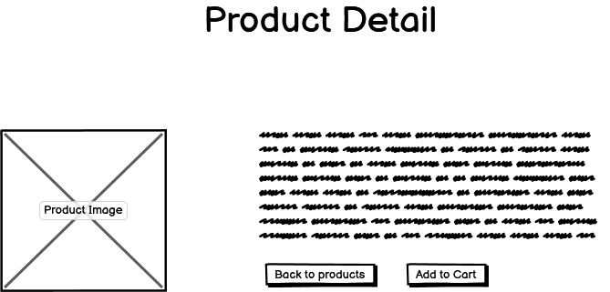
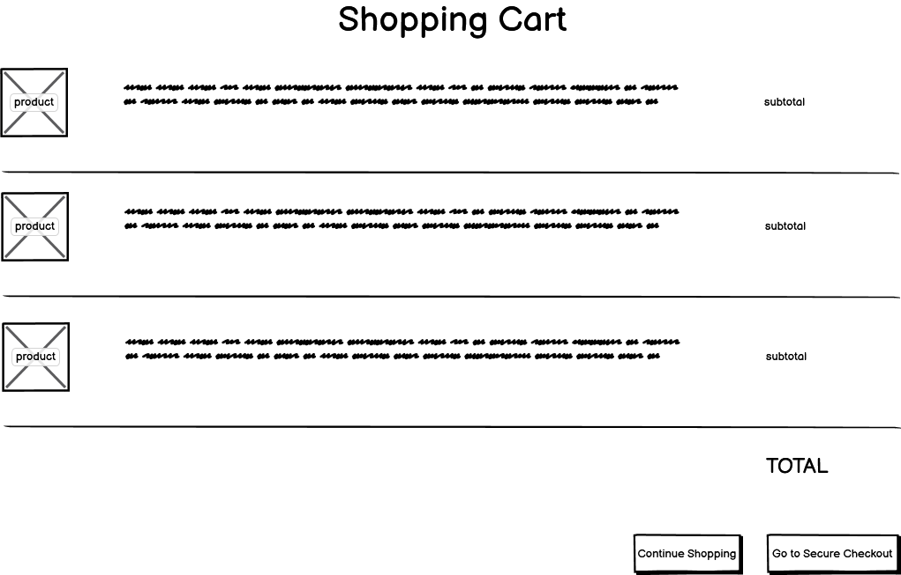
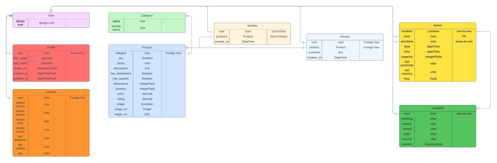

# Dungeon Dwellers 

  

  - [Deployed Site](https://dungeon-dwellers-6fd68f5d0523.herokuapp.com/)

 
## About 
   
  Dungeon Dwellers is an e-commerce site aimed at board game enthusiasts. The name is evocative of the adventuring and exploration which is common for character dirven board games such as Dungeons & Dragons.

---

## UX

### User Stories

|id|user|feature| reason|
|-|-|-|-|

#### Site User

|id|user|feature| reason|
|-|-|-|-|

#### Site owner/ Admin

|id|user|feature| reason|
|-|-|-|-|

## Business model

The business model is B2C, meaning the business sells to the customer. The focus is on one-off payements for products.

### A summary of the customer

Dungeon Dwellers is a site aimed at customers in a specific niche of boardgames and minatures. With a limited pool of a customer base, loyalty is a neccesity. As such, the sales process should be painless, providing top quality UX and UI.

### Strategy

Due to being a niche store, the customer base would expect the store to compete on the following:

- quality of products (licesned products)
- availability
- user experience
- service
- loayalty offers
- price

---

## Web Marketing

- 

## Technologies Used

- ### Languages:

  - [Python 3.12.0](https://www.python.org/downloads/release/python-3120/): used as the primary language used in backend functionality
  - [JavaScript](https://www.javascript.com/): used for interactive components
  - [HTML](https://www.w3schools.com/html/): used to create the skeleton of web pages
  - [CSS](https://www.w3schools.com/css/): used for styling the web pages

- ### Fameworks and Libraries:

  - [Django 4.2.8](https://docs.djangoproject.com/en/5.0/releases/4.2.8/): Python framework for full-stack development
  - [jQuery](https://jquery.com/): using AJAX requests to bridge frontend and backend
  - [Bootstrap](https://getbootstrap.com/): used to create consistent CSS styling

- ### Database:
  
  - [SQLite](https://www.sqlite.org/): was used as a development database.

  - [ElephantSQL](https://www.elephantsql.com/): a cloud based postgreSQL database

- ### Other Tools and Dependencies
  - [Git](https://git-scm.com/): version control for continuous development
  - [Pip](https://pypi.org/project/pip/): python package manager for installing dependencies
  - [AllAuth](https://docs.allauth.org/en/latest/): python package for handling account authentication
  - [Gunicorn](https://gunicorn.org/): Unix model which creates Python wsgi Http server
  - [Django-allauth](https://docs.allauth.org/en/latest/release-notes/recent.html#id11): account creation library for django
  - [GitHub](https://github.com/): cloud repository for source code
  - [CodeAnywhere](https://app.codeanywhere.com/): Cloud IDE service used for the majority of development
  - [Heroku](https://id.heroku.com/login): Used to deploy the webisite
  - [VSCode](https://code.visualstudio.com/): Local IDE used as backup
  - [Chrome DevTools](https://developer.chrome.com/docs/devtools/open/): used to debug 
  - [Font Awesome](https://fontawesome.com/): used to supply icons
  - [Image Extractor](https://extract.pics/): used to scrape images from websites used within the project
  - [W3C Validator](https://validator.w3.org/): HTML validator
  - [W3C CSS validator](https://jigsaw.w3.org/css-validator/): CSS validator
  - [Code Institute Pep8 linter](pep8ci.herokuapp.com): python validation

 ## Features

Please refer to the [FEATURES.md](FEATURES.md) file for all test-related documentation.

---
## Design

- ### Wireframes

- Home view
    
    

- Profile view

    

- Products view

    

- Product detail view

    

- Bag view

    

## Information Architecture

### Database

- The database was created and hosted on [ElephantSQL](https://www.elephantsql.com/)

### Entity Relationship Diagram

- The ERD was created using [Lucidchart](https://lucid.co/)

## Testing

Please refer to [TESTING.md](TESTING.md)

## Deployment

- The site was deployed using [Heroku](https://id.heroku.com/login)
- The database was deployed to [ElephantSQL](https://www.elephantsql.com/)
- The app is available [here](https://board-ohm-5d4ddb906f72.herokuapp.com/)

## Credits

- [CodeInstiute](https://codeinstitute.net/ie/): for giving me the basics of django development used in the site
- [Code Institute - Boutique Ado](https://github.com/Code-Institute-Solutions/boutique_ado_v1/tree/933797d5e14d6c3f072df31adf0ca6f938d02218): which acted as a template for styling and functionality
- [Bootstrap](https://getbootstrap.com/): for giving me the classes for basic and clean styling used in the site
- [Django](https://www.djangoproject.com/): for basic templates and fuctionality used in the site 
- [Font Awesome](https://fontawesome.com/): for icons used in the site
- [Geeks For Geeks](https://www.geeksforgeeks.org/handling-ajax-request-in-django/): used to better understand ajax funtionality
- [Desphixs](https://www.youtube.com/@desphixs): foundation for adding products to a wishlist
- [GoFullPage](chrome://extensions/): can be found on Google Chrome extensions. Captures a full page view of any webpage, the images of which were used throughout documentation
- [Stack Overflow](https://stackoverflow.com/questions/28054991/combining-two-forms-in-one-django-view): to assist with combining several forms into one view
- [Code Institute Pep8 linter](pep8ci.herokuapp.com): allowing me to pep8 validate my python.

## Acknowledgements

- [Iuliia Konovalova](https://github.com/IuliiaKonovalova): my mentor who continually motivates me to go big.
- [CodeInstiute](https://codeinstitute.net/ie/): for giving me the tools and knoweldge
