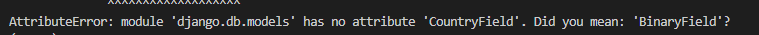
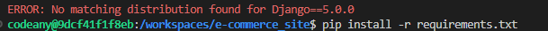
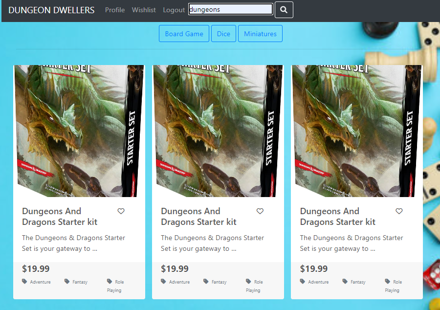
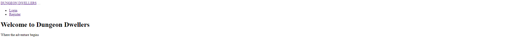
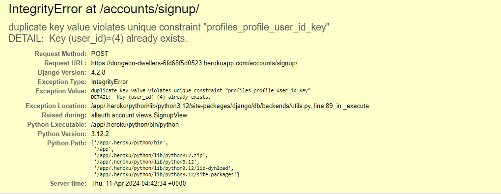
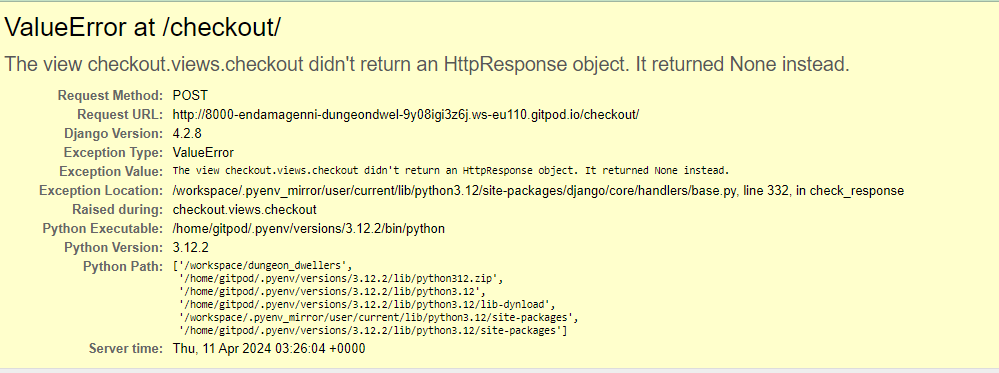

# Testing

[Back to README](README.md)

## Manual Testing

Testing was carried out on a near constant basis, with each new feature

### Account Creation

|#|User action|Expected result| Y/N|
|--|--|--|--|
|1|User clicks on 'Register' link|User is redirected to registration page|Y|
|2|User attempts to signup without filling in required fields|User is promted to fill in relevant required field|Y|
|3|User attempts to signup with existing username|User is prompted to change username|Y|
|4|User attempts to signup without email but all other fields filled correctly|User account is created and user is redirected to home page|Y|
|5|User attempts to signup with all fields filled correctly|User account is created and user is redirected to home page|Y|
|6|User clicks 'sign in' link|User is redirected to login page|Y|

### Account login
|#|User action|Expected result| Y/N|
|--|--|--|--|
|1|User clicks on 'Login' link|User is redirected to login page|Y|
|2|Registered user attempts to login with fields correctly filled in|User is logged in a redirected to home page|Y|
|3|Non-registered user attempts to login with fields filled in|User is told username or password are incorrect|Y|
|4|User clicks 'sign up' link|User is redirected to registration page|Y|

### Pagination
|#|User action|Expected result| Y/N|
|--|--|--|--|
|1|User selects 'next' when pagination is available|User is directed to next page|Y|
|2|User selects 'prev' when pagination is available|User is directed to previous page|Y|

### Home Page
|#|Component|Expected result| Y/N|
|--|--|--|--|
|**Admin User**|
|1|Navbar|Shows 'Home' Link|Y|
|2|Navbar|Doesn't show 'Login' Link|Y|
|3|Navbar|Doesn't show 'Register' Link|Y|
|4|Navbar|Shows 'Logout' Link|Y|
|5|Navbar|Shows 'Profile' link|Y|
|6|Navbar|Shows 'Wishlist' link|Y|
|7|Navbar|Shows 'Products' link|Y|
|8|Navbar|Shows 'Bag' link|Y|
|9|Navbar|Shows 'Searchbar'|Y|
|10|Main Page|Shows Welcome banner and image|Y|
|11|Main Page|Shows 'Browse Games' button|Y|
|12|Main Page|Clicking on 'Browse Games' button directs you to products page|Y|

|**Authenticated User**|
|1|Navbar|Shows 'Home' Link|Y|
|2|Navbar|Doesn't show 'Login' Link|Y|
|3|Navbar|Doesn't show 'Register' Link|Y|
|4|Navbar|Shows 'Logout' Link|Y|
|5|Navbar|Shows 'Profile' link|Y|
|6|Navbar|Shows 'Wishlist' link|Y|
|7|Navbar|Shows 'Products' link|Y|
|8|Navbar|Shows 'Bag' link|Y|
|9|Navbar|Shows 'Searchbar'|Y|
|10|Main Page|Shows Welcome banner and image|Y|
|11|Main Page|Shows 'Browse Games' button|Y|
|12|Main Page|Clicking on 'Browse Games' button directs you to products page|Y|

|**Non-Authenticated User**| 
|1|Navbar|Shows 'Home' Link|Y|
|2|Navbar|Shows 'Login' Link|Y|
|3|Navbar|Shows 'Register' Link|Y|
|4|Navbar|Doesn't show 'Logout' Link|Y|
|5|Navbar|Doesn't show 'Profile' link|Y|
|6|Navbar|Doesn't show 'Wishlist' link|Y|
|7|Navbar|Shows 'Products' link|Y|
|8|Navbar|Shows 'Bag' link|Y|
|9|Navbar|Shows 'Searchbar'|Y|
|10|Main Page|Shows Welcome banner and image|Y|
|11|Main Page|Shows 'Browse Games' button|Y|
|12|Main Page|Clicking on 'Browse Games' button directs you to products page|Y|

### Products page
|#|Component|Expected result| Y/N|
|--|--|--|--|
|**Admin User**|
|1|Navbar|Shows 'Home' Link|Y|
|2|Navbar|Doesn't show 'Login' Link|Y|
|3|Navbar|Doesn't show 'Register' Link|Y|
|4|Navbar|Shows 'Logout' Link|Y|
|5|Navbar|Shows 'Profile' link|Y|
|6|Navbar|Shows 'Wishlist' link|Y|
|7|Navbar|Shows 'Bag' link|Y|
|8|Navbar|Shows 'Searchbar'|Y|
|10|Main Page|Shows Array of products|Y|
|11|Main Page|Products display an 'Edit' button|Y|
|12|Main Page|Shows pagination links|Y|
|13|Clicking on product image directs to product detail page|Y|
|**Authenticated User**|
|1|Navbar|Shows 'Home' Link|Y|
|2|Navbar|Doesn't show 'Login' Link|Y|
|3|Navbar|Doesn't show 'Register' Link|Y|
|4|Navbar|Shows 'Logout' Link|Y|
|5|Navbar|Shows 'Profile' link|Y|
|6|Navbar|Shows 'Wishlist' link|Y|
|7|Navbar|Shows 'Products' link|Y|
|8|Navbar|Shows 'Bag' link|Y|
|9|Navbar|Shows 'Searchbar'|Y|
|10|Main Page|Shows Array of products|Y|
|11|Main Page|Products don't display an 'Edit' button|Y|
|12|Main Page|Shows pagination links|Y|
|13|Clicking on product image directs to product detail page|Y|
|**Non-Authenticated User**| 
|1|Navbar|Shows 'Home' Link|Y|
|2|Navbar|Shows 'Login' Link|Y|
|3|Navbar|Shows 'Register' Link|Y|
|4|Navbar|Doesn't show 'Logout' Link|Y|
|5|Navbar|Doesn't show 'Profile' link|Y|
|6|Navbar|Doesn't show 'Wishlist' link|Y|
|7|Navbar|Shows 'Products' link|Y|
|8|Navbar|Shows 'Bag' link|Y|
|9|Navbar|Shows 'Searchbar'|Y|
|10|Main Page|Shows Array of products|Y|
|11|Main Page|Products don't display an 'Edit' button|Y|
|12|Main Page|Shows pagination links|Y|
|13|Clicking on product image directs to product detail page|Y|

## Error

 ### Solved

- CountryField

Was calling 'model.CountryField' rather than simply 'CountryField'

- Wrong distribution package in requirements
 

- Search was returning multiple instances of the same product
 
Solved by adding '.distinct()' constraint to returned result

 
Solved by adding empty '' to base.html

 

 
 Solved by using signals to retroactively assign the profile_user_id to the newly registered user. A similar error occured with newly registered users and wishlists. The signals were updated to fix that same issue

 ### Persistent
  

  I closely followed the payments tutorials from the boutique ado app and tailored where necessary for my own models, and forms. 
  
  One persistent issue was due to an improper folder name. Once that was resolved, the payment underwent processing but continued to fail due to an error in the form.